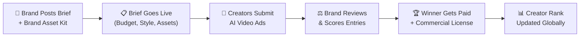

# 🎬 FlixoraPlay — Master Project Plan

> **The World's First Open AI Film Festival Marketplace**
> Where anyone can host, compete, and earn from AI-generated video competitions.

---

## 📋 Table of Contents

1. [Vision & Problem Statement](#1-vision--problem-statement)
2. [Competitive Analysis](#2-competitive-analysis)
3. [🔥 Unique Differentiator: Brand Portal (formerly AdArena)](#3-unique-differentiator-brand-portal)
4. [User Personas](#4-user-personas)
5. [Platform Architecture](#5-platform-architecture)
6. [User Flow Diagrams](#6-user-flow-diagrams)
7. [Feature Roadmap (4 Phases)](#7-feature-roadmap-4-phases)
8. [Database Schema Evolution](#8-database-schema-evolution)
9. [Monetization Strategy](#9-monetization-strategy)
10. [Implementation Timeline](#10-implementation-timeline)

---

## 1. Vision & Problem Statement

### The Problem
- AI video creators have **no dedicated marketplace** to monetize their skills through competitions.
- Existing AI film festivals (Runway AIF, Reply AI, AIFFI) are **curator-gated** — you submit and hope to be selected.
- **No platform lets anyone HOST their own competition** — it's always top-down from festival organizers.
- Brands spend $50K–$500K on AI ad production but have **no way to crowdsource** from global AI talent.
- Talented AI filmmakers globally have **zero access** to Western festival circuits.

### The Vision
FlixoraPlay is the **"Kaggle for AI Filmmaking"** — a two-sided marketplace where:
- **Creators** find competitions, submit work, win prizes, and build a verifiable global ranking.
- **Hosts** (individuals, studios, or brands) create competitions with custom briefs, budgets, and judging criteria.
- **Brands** post paid "Brand Challenges" to crowdsource AI-generated marketing videos from the world's best creators.

### Core Principles
| Principle | Meaning |
|-----------|---------|
| **Open Access** | Anyone can host or compete — no gatekeeping |
| **Skill = Income** | Top creators earn real money through prizes and brand deals |
| **Global Ranking** | A universal leaderboard powered by an ELO rating system |
| **Brand Bridge** | Direct pipeline from Fortune 500 briefs → creator submissions |

---

## 2. Competitive Analysis

### Existing Platforms & Their Gaps

| Platform | What They Do | What They DON'T Do |
|----------|-------------|-------------------|
| **Runway AI Film Festival** | Prestigious annual festival, NYC/LA screenings | No open hosting, no brand marketplace, invitation-only |
| **FilmFreeway** | Submission portal for all film festivals | Not AI-specific, no built-in judging, no ranking system |
| **Curious Refuge** | AI filmmaking community + course platform | Lists festivals but doesn't host them, no competition engine |
| **Anthum AI** | AI ad contest marketplace for DTC brands | Brand-only (creators can't host), narrow ad focus |
| **Vloggi** | Video contest management tool | Generic (not AI-focused), no creator community or ranking |
| **Kling AI Events** | Tool-specific creative challenges | Locked to Kling's ecosystem, not open marketplace |

### FlixoraPlay's Position

```
                    ┌─────────────────────────────────────┐
                    │         OPEN HOSTING                │
                    │   (Anyone can create competitions)  │
                    │                                     │
         Vloggi ●   │                    ★ FlixoraPlay    │
                    │                                     │
                    │                                     │
  ──────────────────┼─────────────────────────────────────┼──
  GENERIC           │                                     │ AI-SPECIFIC
                    │                                     │
                    │                                     │
    FilmFreeway ●   │              ● Anthum AI            │
                    │   ● Runway AIF    ● Reply AI        │
                    │                                     │
                    │         CURATED / GATED             │
                    │   (Organizer-controlled festivals)  │
                    └─────────────────────────────────────┘
```

> **FlixoraPlay occupies the ONLY quadrant that is both AI-specific AND open-access.**

---

## 3. 🔥 Unique Differentiator: Brand Portal

> [!IMPORTANT]
> This is the killer feature that NO competitor offers — a dedicated marketplace where brands post paid AI video ad briefs and creators compete for the contract, now with a dedicated cinematic B2B transition UI.

### How Brands Work



### Brand Asset Kit Integration ✅ (COMPLETED)
Brands can now attach a `brand_kit_url` to their briefs. This allows creators to download a .zip or access a Drive folder containing:
- High-res vector logos
- Typography and brand guidelines
- Product imagery
- Voiceover scripts

### Revenue Model from Brands
- **Platform Fee**: 15% of prize pool (Brand pays $2,000 → Creator gets $1,700, Platform gets $300)
- **Featured Listing**: Brands pay $99–$499 to pin their brief at the top of the Contests page
- **Talent Scout**: Brands can directly hire top-ranked creators (Platform takes 10% finder's fee)

---

## 4. User Personas

### 👤 Persona 1: The Creator (Arya, 24, Mumbai)
- **Goal**: Monetize AI video skills, build portfolio
- **FlixoraPlay Journey**: Contests → Enter free competitions → Win → Increase ELO Rating → Attract brand briefs → Earn

### 👤 Persona 2: The Host (Dev, 31, Creator Economy YouTuber)
- **Goal**: Run an AI film contest for his audience
- **FlixoraPlay Journey**: Sign up → Create competition → Share link → Judge entries → Announce winners

### 👤 Persona 3: The Brand (Meera, Marketing Director, D2C Skincare Brand)
- **Goal**: Get 30-second AI video ads for Instagram/TikTok
- **FlixoraPlay Journey**: Post Brand brief ($1,500 prize) + Asset Kit → Get 40+ submissions → Pick winner → Download with commercial license

### 👤 Persona 4: The Viewer (Priya, 19, Film Student)
- **Goal**: Watch amazing AI films, vote for favorites in head-to-head ELO match-ups
- **FlixoraPlay Journey**: Land on homepage → Browse Contests → Arena Voting → Boost creators up the Leaderboard

---

## 5. Platform Architecture

### Tech Stack (Current V4.5)

| Layer | Technology | Status |
|-------|-------------|-------------|
| Frontend | Vanilla HTML/CSS/JS (Vite/Build tool ready) | ✅ Active (Root-relative Structure) |
| Backend | Cloudflare Pages Functions | ✅ Active |
| Database | Cloudflare D1 (SQLite via Turso/Wrangler) | ✅ Active |
| Auth | Local Storage session wrappers | ⚠️ Needs upgrade to JWT |
| UI Framework | Custom CSS System (`main.css`) | ✅ Active (Standardized) |
| Icons | Lucide Icons | ✅ Active |

---

## 6. ELO Head-to-Head Voting System ✅ (COMPLETED)

We have successfully shifted from a simple "upvote" system to a dynamic **Head-to-Head ELO Rating System**, heavily inspired by competitive ranking algorithms (like Chess or FaceMash). 

### How it works:
1. **The Arena**: Viewers are presented with two random AI video entries side-by-side.
2. **The Vote**: The viewer selects the better video.
3. **The Algorithm**: The winner takes ELO points from the loser. If a low-ranked video beats a high-ranked video, the points exchanged are significantly higher.
4. **The Result**: The Leaderboard is now a true reflection of quality, driven by thousands of micro-decisions rather than just popularity contests.

---

## 7. Feature Roadmap (4 Phases)

### Phase 1: Foundation ✅ (COMPLETED)
| Feature | Status | Notes |
|---------|--------|-------|
| Project Restructuring | ✅ Done | Segregated into `/pages`, `/auth`, `/adarena`, `/competitions`, `/user` |
| UI Standardization | ✅ Done | Unified navbars, removal of scroll-snapping, consistent cinematic cards |
| D1 Database Backend | ✅ Done | Full CRUD API |

### Phase 2: Core Platform Validation ✅ (COMPLETED)
| Feature | Status | Notes |
|---------|--------|-------|
| **ELO Voting System** | ✅ Done | Implemented backend endpoints and scoring algorithm |
| **Brand Asset Kit** | ✅ Done | Database schema updated and integrated into UI |
| **Global Leaderboard Fixes** | ✅ Done | Points rendering corrected and UI streamlined |
| **Brand Portal UI** | ✅ Done | Cinematic dark-slate transition implemented for B2B distinction |

### Phase 3: Growth & Security ⏳ (CURRENT SPRINT)
| Feature | Priority | Description |
|---------|----------|-------------|
| **Password hashing** | 🔴 Critical | bcrypt/argon2 — currently plaintext |
| **JWT sessions** | 🔴 Critical | Replace localStorage sessions with signed tokens |
| **Rate Limiting** | 🔴 Critical | Protect the `/api/elo-vote` endpoint from abuse/bot voting |
| **Google OAuth** | 🟡 High | One-click sign-in via Google |
| **Stripe payments** | 🔴 Critical | Prize pool escrow, platform fees, payouts |
| **"Crazy Stuff" Section** | 🟡 High | Implement the "Coming Soon" section on the homepage |

### Phase 4: Scale & Ecosystem (V6+)
| Feature | Priority | Description |
|---------|----------|-------------|
| **Creator tiers** | 🟡 High | Bronze → Silver → Gold → Platinum based on ranking |
| **Direct video upload** | 🟡 High | Upload to Cloudflare R2 (bypass YouTube requirement) |
| **AI analysis scoring** | 🟡 High | Optional AI-assisted judging (technical quality metrics) |

---

## 8. Database Schema Evolution

### Recent Schema Updates (V4.5)

```sql
-- ═══ ELO RATING ADDITION ═══
ALTER TABLE entries ADD COLUMN elo_rating INTEGER DEFAULT 1200;
ALTER TABLE entries ADD COLUMN matches_played INTEGER DEFAULT 0;

-- ═══ BRAND ASSET KIT ADDITION ═══
ALTER TABLE competitions ADD COLUMN brand_kit_url TEXT;
```

---

## 9. Monetization Strategy

### Revenue Streams
- **Brand Fees (15%)**
- **Featured Listings**
- **Talent Scout Fees (10%)**
- **Pro Host Plans**

---

## 10. 📎 Appendix: Pages Inventory (Post-Restructure)

### Current Organized Structure

| Page | Path | Status |
|------|------|--------|
| Landing | `/index.html` | ✅ Working (Includes 'Coming Soon' section) |
| Contests (Browse) | `/pages/browse.html` | ✅ Working (Renamed in UI) |
| Leaderboard | `/pages/leaderboard.html` | ✅ Working |
| About | `/pages/about.html` | ✅ Working |
| Brand (AdArena) | `/adarena/adarena.html` | ✅ Working (Cinematic Dark Mode) |
| Brand Brief Detail | `/adarena/brief.html` | ✅ Working |
| Create Brand Brief | `/adarena/create-brief.html` | ✅ Working |
| Competition Detail | `/competitions/competition.html` | ✅ Working |
| Create Competition | `/competitions/create-competition.html` | ✅ Working |
| Judge Panel | `/competitions/judge.html` | ✅ Working |
| ELO Arena | `/competitions/arena.html` | ✅ Working (Head-to-head) |
| Login | `/auth/login.html` | ✅ Working |
| Register | `/auth/register.html` | ✅ Working |
| Dashboard | `/user/dashboard.html` | ✅ Working |
| Profile | `/user/profile.html` | ✅ Working |
| Settings | `/user/settings.html` | ✅ Working |

---

## 🎯 Next Immediate Actions

1. **Develop "Crazy Stuff"**: Flesh out the placeholder section on the homepage.
2. **Security First**: Implement password hashing and JWT tokens.
3. **Rate Limiting**: Protect the ELO voting system from manipulation.
4. **Google OAuth**: Add one-click sign-in to reduce registration friction.

---

*Document Version: 2.0 | Updated: June 11, 2026 | Author: FlixoraPlay AI Planning*
