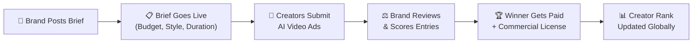
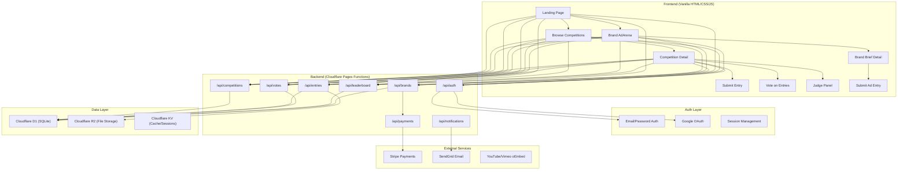
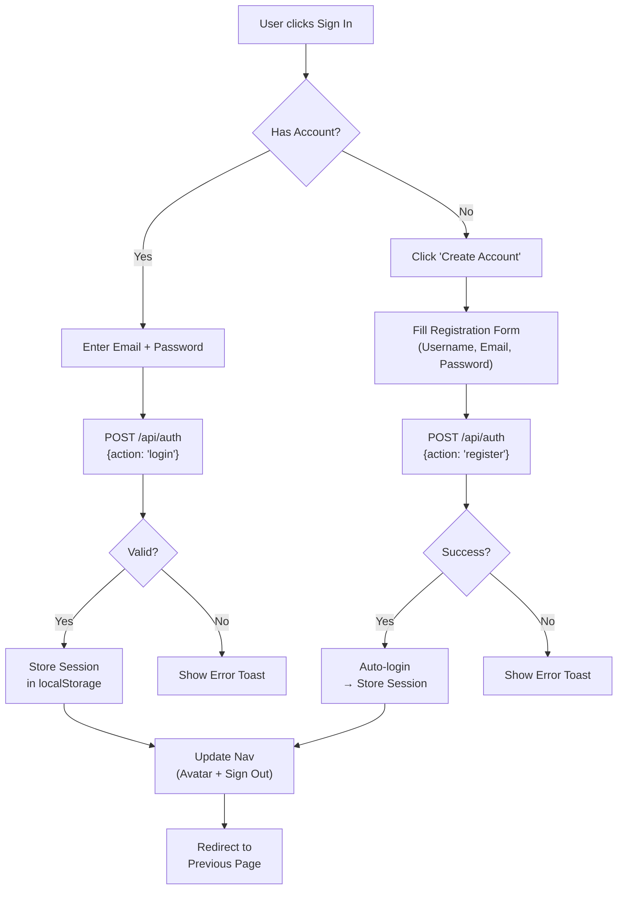
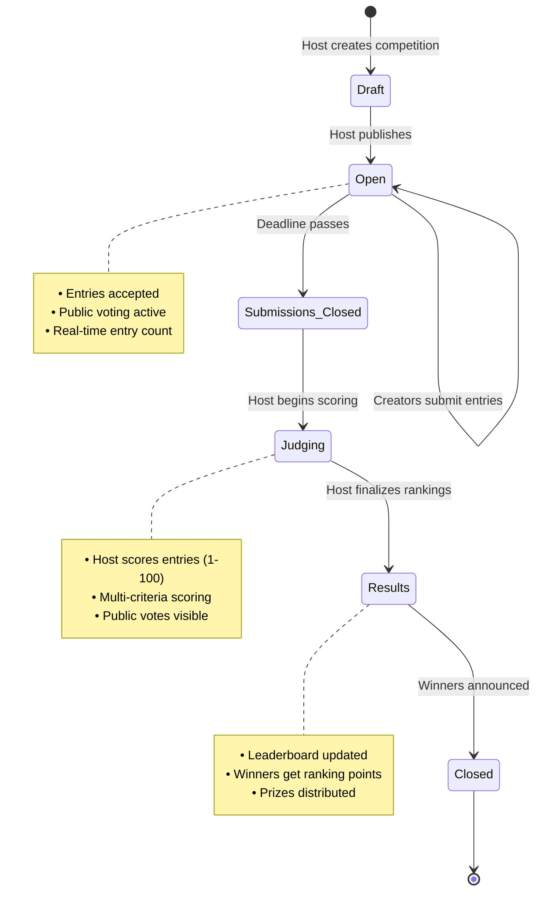
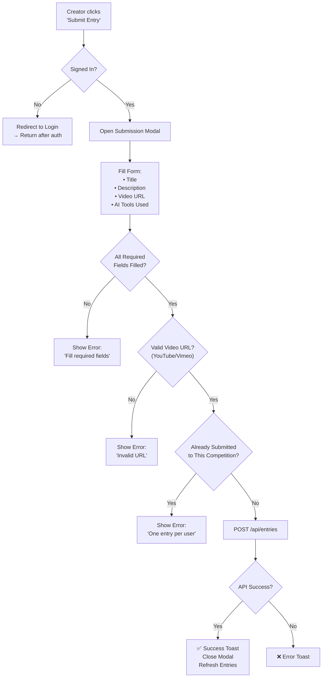
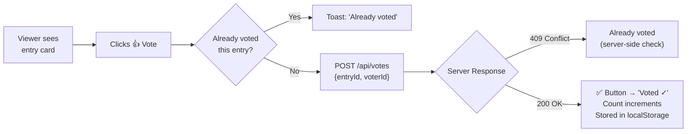
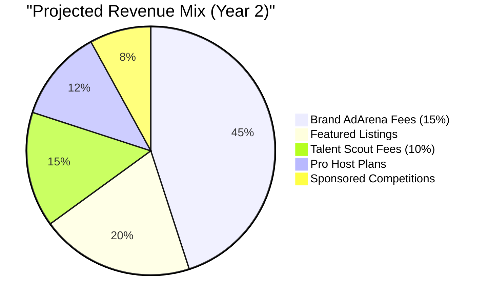

# 🎬 FlixoraPlay — Master Project Plan

> **The World's First Open AI Film Festival Marketplace**
> Where anyone can host, compete, and earn from AI-generated video competitions.

---

## 📋 Table of Contents

1. [Vision & Problem Statement](#1-vision--problem-statement)
2. [Competitive Analysis](#2-competitive-analysis)
3. [🔥 Unique Differentiator: Brand AdArena™](#3-unique-differentiator-brand-adarena)
4. [User Personas](#4-user-personas)
5. [Platform Architecture](#5-platform-architecture)
6. [User Flow Diagrams](#6-user-flow-diagrams)
7. [Feature Roadmap (4 Phases)](#7-feature-roadmap-4-phases)
8. [Database Schema Evolution](#8-database-schema-evolution)
9. [Monetization Strategy](#9-monetization-strategy)
10. [Implementation Timeline](#10-implementation-timeline)

---

## 1. Vision & Problem Statement

### The Problem
- AI video creators have **no dedicated marketplace** to monetize their skills through competitions
- Existing AI film festivals (Runway AIF, Reply AI, AIFFI) are **curator-gated** — you submit and hope to be selected
- **No platform lets anyone HOST their own competition** — it's always top-down from festival organizers
- Brands spend $50K–$500K on AI ad production but have **no way to crowdsource** from global AI talent
- Talented AI filmmakers in India, Southeast Asia, Africa have **zero access** to Western festival circuits

### The Vision
FlixoraPlay is the **"Kaggle for AI Filmmaking"** — a two-sided marketplace where:
- **Creators** find competitions, submit work, win prizes, and build a verifiable global ranking
- **Hosts** (individuals, studios, or brands) create competitions with custom briefs, budgets, and judging criteria
- **Brands** post paid "Ad Challenges" to crowdsource AI-generated marketing videos from the world's best creators

### Core Principles
| Principle | Meaning |
|-----------|---------|
| **Open Access** | Anyone can host or compete — no gatekeeping |
| **Skill = Income** | Top creators earn real money through prizes and brand deals |
| **Global Ranking** | A universal leaderboard that becomes a creator's portfolio |
| **Brand Bridge** | Direct pipeline from Fortune 500 briefs → creator submissions |

---

## 2. Competitive Analysis

### Existing Platforms & Their Gaps

| Platform | What They Do | What They DON'T Do |
|----------|-------------|-------------------|
| **Runway AI Film Festival** | Prestigious annual festival, NYC/LA screenings | No open hosting, no brand marketplace, invitation-only |
| **FilmFreeway** | Submission portal for all film festivals | Not AI-specific, no built-in judging, no ranking system |
| **Curious Refuge** | AI filmmaking community + course platform | Lists festivals but doesn't host them, no competition engine |
| **Anthum AI** | AI ad contest marketplace for DTC brands | Brand-only (creators can't host), narrow ad focus |
| **Vloggi** | Video contest management tool | Generic (not AI-focused), no creator community or ranking |
| **Kling AI Events** | Tool-specific creative challenges | Locked to Kling's ecosystem, not open marketplace |

### FlixoraPlay's Position

```
                    ┌─────────────────────────────────────┐
                    │         OPEN HOSTING                │
                    │   (Anyone can create competitions)  │
                    │                                     │
         Vloggi ●   │                    ★ FlixoraPlay    │
                    │                                     │
                    │                                     │
  ──────────────────┼─────────────────────────────────────┼──
  GENERIC           │                                     │ AI-SPECIFIC
                    │                                     │
                    │                                     │
    FilmFreeway ●   │              ● Anthum AI            │
                    │   ● Runway AIF    ● Reply AI        │
                    │                                     │
                    │         CURATED / GATED             │
                    │   (Organizer-controlled festivals)  │
                    └─────────────────────────────────────┘
```

> **FlixoraPlay occupies the ONLY quadrant that is both AI-specific AND open-access.**

---

## 3. 🔥 Unique Differentiator: Brand AdArena™

> [!IMPORTANT]
> This is the killer feature that NO competitor offers — a dedicated marketplace where brands post paid AI video ad briefs and creators compete for the contract.

### How Brand AdArena Works



### Why This is a Game-Changer

| For Brands | For Creators |
|-----------|-------------|
| Get 50+ AI ad variations for the price of 1 winner | Real paid work, not just "exposure" |
| Test creative directions before committing to production | Build a verified portfolio with brand logos |
| Access global talent pool, not just local agencies | Global ranking = credibility for future brand deals |
| Pay only for results they love | Skills → Income pipeline |

### Brand AdArena Brief Structure
```
┌─────────────────────────────────────────┐
│  🏢 BRAND AD BRIEF                     │
├─────────────────────────────────────────┤
│  Brand:        Nike                     │
│  Campaign:     "Air Max AI Dreams"      │
│  Style:        Cinematic, futuristic    │
│  Duration:     15-30 seconds            │
│  Budget:       $2,000 (winner)          │
│  Runner-up:    $500 each (top 3)        │
│  Deadline:     30 days                  │
│  Requirements: Must include product     │
│  License:      Full commercial rights   │
│  Submissions:  Unlimited                │
│  AI Tools:     Any                      │
└─────────────────────────────────────────┘
```

### Revenue Model from AdArena
- **Platform Fee**: 15% of prize pool (Brand pays $2,000 → Creator gets $1,700, Platform gets $300)
- **Featured Listing**: Brands pay $99–$499 to pin their brief at the top of Browse page
- **Talent Scout**: Brands can directly hire top-ranked creators (Platform takes 10% finder's fee)

---

## 4. User Personas

### 👤 Persona 1: The Creator (Arya, 24, Mumbai)
- **Goal**: Monetize AI video skills, build portfolio
- **Pain**: No platform connects skill to income
- **Behavior**: Uses Runway ML, Kling AI, Sora daily; posts on YouTube/X
- **FlixoraPlay Journey**: Browse → Enter free competitions → Win → Get ranked → Attract brand briefs → Earn

### 👤 Persona 2: The Host (Dev, 31, Creator Economy YouTuber)
- **Goal**: Run an AI film contest for his audience
- **Pain**: No turnkey solution — has to manually collect entries via Google Forms
- **Behavior**: 200K YouTube subscribers, wants to engage community
- **FlixoraPlay Journey**: Sign up → Create competition → Share link → Judge entries → Announce winners

### 👤 Persona 3: The Brand (Meera, Marketing Director, D2C Skincare Brand)
- **Goal**: Get 30-second AI video ads for Instagram/TikTok
- **Pain**: Agency quoted $15K; wants to try crowdsourced AI creative
- **Behavior**: Posts 3 ad creatives/week, A/B tests everything
- **FlixoraPlay Journey**: Post AdArena brief ($1,500 prize) → Get 40+ submissions → Pick winner → Download with commercial license

### 👤 Persona 4: The Viewer (Priya, 19, Film Student)
- **Goal**: Watch amazing AI films, vote for favorites
- **Pain**: No single place to discover the best AI video content
- **Behavior**: Browses TikTok and YouTube Shorts daily
- **FlixoraPlay Journey**: Land on homepage → Browse competitions → Watch entries → Vote → Follow top creators

---

## 5. Platform Architecture

### System Architecture Diagram



### Tech Stack (Current → Target)

| Layer | Current (V3) | Target (V5) |
|-------|-------------|-------------|
| Frontend | Vanilla HTML/CSS/JS | Same (keep lightweight) |
| Backend | Cloudflare Pages Functions | Same + more endpoints |
| Database | D1 (SQLite) | D1 + R2 for media |
| Auth | Basic email/password | + Google OAuth + JWT |
| Payments | None | Stripe Connect |
| Email | None | SendGrid/Resend |
| Cache | None | Cloudflare KV |
| CDN | Cloudflare Pages | Same |

---

## 6. User Flow Diagrams

### 6.1 Master Platform Flow

```mermaid
flowchart TD
    START(("🌐 User Lands\non FlixoraPlay")) --> AUTH{"Signed In?"}

    AUTH -->|No| GUEST["👁️ Guest Mode\n• Browse competitions\n• Watch entries\n• Vote (anonymous)"]
    AUTH -->|Yes| ROLE{"Choose Path"}

    GUEST --> SIGNUP["📝 Sign Up / Sign In"]
    SIGNUP --> ROLE

    ROLE -->|"I want to compete"| CREATOR_FLOW
    ROLE -->|"I want to host"| HOST_FLOW
    ROLE -->|"I'm a brand"| BRAND_FLOW
    ROLE -->|"Just browsing"| VIEWER_FLOW

    subgraph CREATOR_FLOW ["🎨 Creator Flow"]
        CF1["Browse Open Competitions"] --> CF2["Pick a Competition"]
        CF2 --> CF3["Read Brief & Rules"]
        CF3 --> CF4["Create AI Video\n(External tools)"]
        CF4 --> CF5["Submit Entry\n(YouTube/Vimeo link)"]
        CF5 --> CF6["Wait for Judging\n+ Collect Votes"]
        CF6 --> CF7{"Won?"}
        CF7 -->|Yes| CF8["🏆 Earn Prize +\nGlobal Ranking Points"]
        CF7 -->|No| CF9["📊 Get Feedback\nTry Again"]
    end

    subgraph HOST_FLOW ["📢 Host Flow"]
        HF1["Click 'Host Competition'"] --> HF2["Fill Competition Form\n(Title, Theme, Prize, Deadline)"]
        HF2 --> HF3["Competition Goes Live"]
        HF3 --> HF4["Share Link\nto Attract Creators"]
        HF4 --> HF5["Entries Come In"]
        HF5 --> HF6["Open Judge Panel\nScore Each Entry"]
        HF6 --> HF7["Announce Winners\n+ Distribute Prizes"]
    end

    subgraph BRAND_FLOW ["🏢 Brand AdArena Flow"]
        BF1["Post Ad Brief\n(Budget + Requirements)"] --> BF2["Pay Prize Pool\n(Stripe Escrow)"]
        BF2 --> BF3["Brief Goes Live\non AdArena"]
        BF3 --> BF4["Creators Submit\nAI Video Ads"]
        BF4 --> BF5["Review & Score\nSubmissions"]
        BF5 --> BF6["Select Winner"]
        BF6 --> BF7["Winner Gets Paid\n+ Brand Gets License"]
    end

    subgraph VIEWER_FLOW ["👁️ Viewer Flow"]
        VF1["Browse Competitions"] --> VF2["Watch Entries"]
        VF2 --> VF3["Vote for Favorites"]
        VF3 --> VF4["Check Leaderboard"]
        VF4 --> VF5["Follow Top Creators"]
    end
```



### 6.2 Authentication Flow



### 6.3 Competition Lifecycle



### 6.4 Entry Submission Flow



### 6.5 Voting System Flow



---

## 7. Feature Roadmap (4 Phases)

### Phase 1: Foundation ✅ (Current State — V3)
> What's already built

| Feature | Status | Notes |
|---------|--------|-------|
| Landing page with hero | ✅ Done | Glassmorphic design |
| User registration/login | ✅ Done | Email + password |
| Browse competitions | ✅ Done | Grid view with search |
| Create competition | ✅ Done | Full form with preview |
| Submit video entries | ✅ Done | YouTube/Vimeo links |
| Public voting | ✅ Done | Anonymous, 1 per entry |
| Manual judging panel | ✅ Done | Multi-criteria scoring |
| Global leaderboard | ✅ Done | Points-based ranking |
| D1 database backend | ✅ Done | Full CRUD API |
| Responsive design | ✅ Done | Mobile-friendly |

### Phase 2: Core Platform (Next Sprint — V4)
> Stabilize, secure, and make production-ready

| Feature | Priority | Description |
|---------|----------|-------------|
| **Password hashing** | 🔴 Critical | bcrypt/argon2 — currently plaintext |
| **JWT sessions** | 🔴 Critical | Replace localStorage sessions with signed tokens |
| **Google OAuth** | 🟡 High | One-click sign-in via Google |
| **Email verification** | 🟡 High | Verify email on registration |
| **User profiles** | 🟡 High | Avatar, bio, competition history, win count |
| **Video embed preview** | 🟡 High | Inline YouTube/Vimeo player on entry cards |
| **Competition categories** | 🟢 Medium | Tags: Sci-Fi, Nature, Commercial, Abstract, etc. |
| **Search & filter** | 🟢 Medium | Filter by status, category, prize, deadline |
| **Notification system** | 🟢 Medium | Email alerts for new entries, results, deadlines |
| **Share buttons** | 🟢 Medium | Share competition links to X, WhatsApp, LinkedIn |
| **Mobile hamburger nav** | 🟢 Medium | Responsive mobile navigation menu |
| **Rate limiting** | 🟢 Medium | Prevent API abuse |
| **Input sanitization** | 🔴 Critical | XSS protection on all user inputs |

### Phase 3: Growth Engine (V5)
> The features that make FlixoraPlay go viral

| Feature | Priority | Description |
|---------|----------|-------------|
| **🔥 Brand AdArena** | 🔴 Critical | Paid brand brief marketplace (see Section 3) |
| **Stripe payments** | 🔴 Critical | Prize pool escrow, platform fees, payouts |
| **Creator portfolios** | 🟡 High | Public profile pages with all entries + wins |
| **Direct video upload** | 🟡 High | Upload to Cloudflare R2 (bypass YouTube requirement) |
| **AI tool badges** | 🟡 High | Verified badges for tools used (Sora, Runway, etc.) |
| **Follow system** | 🟢 Medium | Follow creators, get notified of their new entries |
| **Comments & reactions** | 🟢 Medium | Discuss entries, give feedback |
| **Hybrid judging** | 🟢 Medium | Weighted: 60% host score + 40% public votes |
| **Competition templates** | 🟢 Medium | One-click templates for common competition types |
| **Embeddable widgets** | 🟢 Medium | Embed competition cards on external websites |
| **API for partners** | 🟢 Medium | Public API for third-party integrations |

### Phase 4: Scale & Ecosystem (V6+)
> Platform maturity and ecosystem expansion

| Feature | Priority | Description |
|---------|----------|-------------|
| **Creator tiers** | 🟡 High | Bronze → Silver → Gold → Platinum based on ranking |
| **AI analysis scoring** | 🟡 High | Optional AI-assisted judging (technical quality metrics) |
| **Team competitions** | 🟢 Medium | Collaborate as a team on entries |
| **Live streaming finals** | 🟢 Medium | Watch parties for winner announcements |
| **Creator Fund** | 🟢 Medium | Monthly payouts to top-ranked creators from ad revenue |
| **NFT certificates** | 🟠 Low | Blockchain-verified winner certificates |
| **Mobile app (PWA)** | 🟢 Medium | Installable progressive web app |
| **Multi-language** | 🟢 Medium | Hindi, Spanish, Portuguese, Japanese |
| **Festival partnerships** | 🟡 High | White-label FlixoraPlay for existing film festivals |
| **Creator courses** | 🟠 Low | Tutorials on AI video creation (revenue share) |

---

## 8. Database Schema Evolution

### Current Schema (V3)
```sql
-- 4 tables: users, competitions, entries, votes
-- See schema.sql in project root
```

### Target Schema (V5) — New Tables Needed

```sql
-- ═══ ENHANCED USERS ═══
ALTER TABLE users ADD COLUMN password_hash TEXT;
ALTER TABLE users ADD COLUMN avatar_url TEXT;
ALTER TABLE users ADD COLUMN bio TEXT;
ALTER TABLE users ADD COLUMN role TEXT DEFAULT 'creator';
-- role: 'creator' | 'host' | 'brand' | 'admin'
ALTER TABLE users ADD COLUMN verified INTEGER DEFAULT 0;
ALTER TABLE users ADD COLUMN google_id TEXT;
ALTER TABLE users ADD COLUMN total_points INTEGER DEFAULT 0;
ALTER TABLE users ADD COLUMN tier TEXT DEFAULT 'bronze';

-- ═══ ENHANCED COMPETITIONS ═══
ALTER TABLE competitions ADD COLUMN category TEXT;
ALTER TABLE competitions ADD COLUMN rules TEXT;
ALTER TABLE competitions ADD COLUMN max_entries INTEGER;
ALTER TABLE competitions ADD COLUMN entry_count INTEGER DEFAULT 0;
ALTER TABLE competitions ADD COLUMN is_brand_brief INTEGER DEFAULT 0;
ALTER TABLE competitions ADD COLUMN brand_id TEXT;
ALTER TABLE competitions ADD COLUMN prize_pool_cents INTEGER DEFAULT 0;
ALTER TABLE competitions ADD COLUMN featured INTEGER DEFAULT 0;

-- ═══ BRAND PROFILES ═══
CREATE TABLE brands (
    id              TEXT PRIMARY KEY,
    user_id         TEXT NOT NULL,
    company_name    TEXT NOT NULL,
    logo_url        TEXT,
    website         TEXT,
    industry        TEXT,
    verified        INTEGER DEFAULT 0,
    stripe_account  TEXT,
    created_at      TEXT NOT NULL,
    FOREIGN KEY (user_id) REFERENCES users(id)
);

-- ═══ PAYMENTS ═══
CREATE TABLE payments (
    id              TEXT PRIMARY KEY,
    competition_id  TEXT NOT NULL,
    payer_id        TEXT NOT NULL,
    payee_id        TEXT,
    amount_cents    INTEGER NOT NULL,
    type            TEXT NOT NULL,
    -- type: 'prize_escrow' | 'winner_payout' | 'platform_fee'
    status          TEXT DEFAULT 'pending',
    stripe_id       TEXT,
    created_at      TEXT NOT NULL,
    FOREIGN KEY (competition_id) REFERENCES competitions(id)
);

-- ═══ NOTIFICATIONS ═══
CREATE TABLE notifications (
    id          TEXT PRIMARY KEY,
    user_id     TEXT NOT NULL,
    type        TEXT NOT NULL,
    -- type: 'new_entry' | 'vote_received' | 'results_announced'
    --       'brief_posted' | 'deadline_reminder' | 'payment'
    title       TEXT NOT NULL,
    message     TEXT,
    read        INTEGER DEFAULT 0,
    link        TEXT,
    created_at  TEXT NOT NULL,
    FOREIGN KEY (user_id) REFERENCES users(id)
);

-- ═══ FOLLOWS ═══
CREATE TABLE follows (
    follower_id TEXT NOT NULL,
    following_id TEXT NOT NULL,
    created_at  TEXT NOT NULL,
    PRIMARY KEY (follower_id, following_id)
);

-- ═══ COMMENTS ═══
CREATE TABLE comments (
    id          TEXT PRIMARY KEY,
    entry_id    TEXT NOT NULL,
    user_id     TEXT NOT NULL,
    content     TEXT NOT NULL,
    created_at  TEXT NOT NULL,
    FOREIGN KEY (entry_id) REFERENCES entries(id),
    FOREIGN KEY (user_id) REFERENCES users(id)
);
```

---

## 9. Monetization Strategy

### Revenue Streams



### Pricing Tiers

| Tier | Price | Features |
|------|-------|----------|
| **Free (Creator)** | $0 | Enter unlimited competitions, public profile, voting |
| **Free (Host)** | $0 | Host up to 3 competitions/month, manual judging |
| **Pro Host** | $19/mo | Unlimited competitions, custom branding, analytics, hybrid judging |
| **Brand Starter** | $99/brief | Post 1 AdArena brief, up to $1K prize pool |
| **Brand Pro** | $299/mo | Unlimited briefs, talent scouting, priority support, analytics dashboard |
| **Enterprise** | Custom | White-label, dedicated account manager, API access |

### Key Metrics to Track
- **GMV** (Gross Merchandise Value): Total prize money flowing through platform
- **Take Rate**: Platform's cut of GMV (target: 12-15%)
- **MAU**: Monthly Active Users
- **Competitions Created**: Monthly new competitions
- **Submission Rate**: Entries per competition (target: 15+ avg)
- **Creator Retention**: % of creators who enter 2+ competitions

---

## 10. Implementation Timeline

### Gantt Overview

```
Phase 2 (V4) — Core Platform
├── Week 1-2:  Auth security (hashing, JWT, OAuth)
├── Week 3:    User profiles + avatars
├── Week 4:    Video embed previews
├── Week 5:    Categories, search, filter
├── Week 6:    Notifications + email
├── Week 7:    Mobile nav + responsive polish
└── Week 8:    Testing + deployment

Phase 3 (V5) — Growth Engine
├── Week 9-10:  Stripe integration + payment flows
├── Week 11-12: Brand AdArena MVP
├── Week 13:    Creator portfolios
├── Week 14:    Direct video upload (R2)
├── Week 15:    Follow system + comments
├── Week 16:    Beta launch + feedback

Phase 4 (V6) — Scale
├── Month 5-6:  Creator tiers + gamification
├── Month 7:    AI analysis scoring
├── Month 8:    PWA + multi-language
├── Month 9+:   Partnership outreach
```

---

## 📎 Appendix: Pages Inventory

### Current Pages & Their Status

| Page | File | Status | Phase 2 Changes Needed |
|------|------|--------|----------------------|
| Landing | `index.html` | ✅ Working | Add AdArena preview section |
| Browse | `browse.html` | ✅ Working | Add filters, categories, search |
| Competition Detail | `competition.html` | ✅ Working | Add video embeds, comments |
| Create Competition | `create-competition.html` | ✅ Working | Add categories, rules field |
| Judge Panel | `judge.html` | ✅ Working | Add hybrid scoring option |
| Leaderboard | `leaderboard.html` | ✅ Working | Add tier badges, time filters |
| Login | `login.html` | ✅ Working | Add Google OAuth button |
| Register | `register.html` | ✅ Working | Add email verification flow |
| About | `about.html` | ✅ Working | Update with AdArena info |

### New Pages Needed

| Page | File | Phase | Description |
|------|------|-------|-------------|
| User Profile | `profile.html` | Phase 2 | Public creator/host profile |
| Settings | `settings.html` | Phase 2 | Account settings, password change |
| AdArena Browse | `adarena.html` | Phase 3 | Browse brand briefs |
| AdArena Brief | `brief.html` | Phase 3 | Individual brand brief detail |
| Brand Dashboard | `brand-dashboard.html` | Phase 3 | Brand's competition management |
| Creator Dashboard | `dashboard.html` | Phase 3 | Creator's entries, stats, earnings |
| Notifications | `notifications.html` | Phase 2 | Notification center |

---

## 🎯 Next Immediate Actions

> [!TIP]
> Start with these 5 tasks to move from planning to execution:

1. **Security First**: Implement password hashing and JWT tokens (Phase 2, Week 1)
2. **Google OAuth**: Add one-click sign-in to reduce registration friction
3. **Video Embeds**: Show inline YouTube players instead of just links — immediate UX win
4. **User Profiles**: Create `profile.html` with competition history and win count
5. **Mobile Nav**: Add hamburger menu for mobile responsiveness

---

*Document Version: 1.0 | Created: June 10, 2026 | Author: FlixoraPlay Planning*
